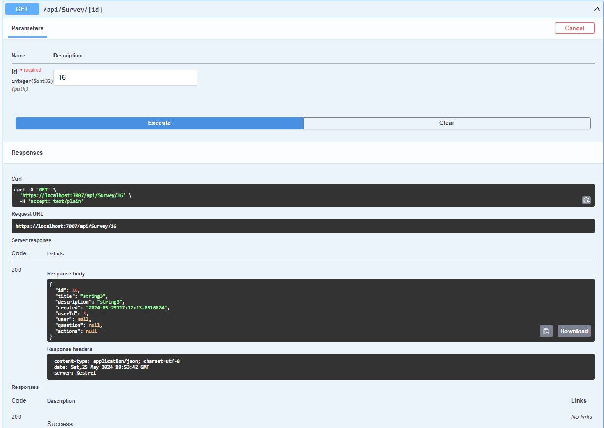

# Тестування працездатності системи

## Засоби тестування
Тестування CRUD застосунку проводиться за допомогою Swagger UI.

### Отримання данних по всім Survey

### Отримання інформації по id Survey

### Створення нового Survey

#### Помилка створення опитування по причині: "Не авторизований користувач не може його створити"

### Видалення опитування

#### Помилка видалення опитування по причині: "Такого опитування не знайдено"

### Вміст таблиці 'Survey' у базі даних після видалення опитування

### Оновлення Опитування

### Вміст таблиці 'Survey' у базі даних після виконання усіх операцій

